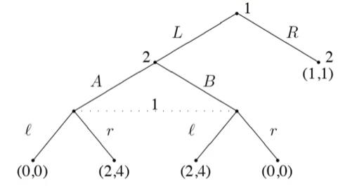
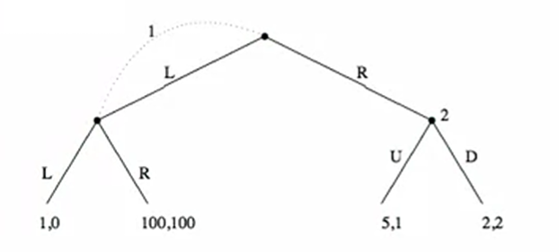
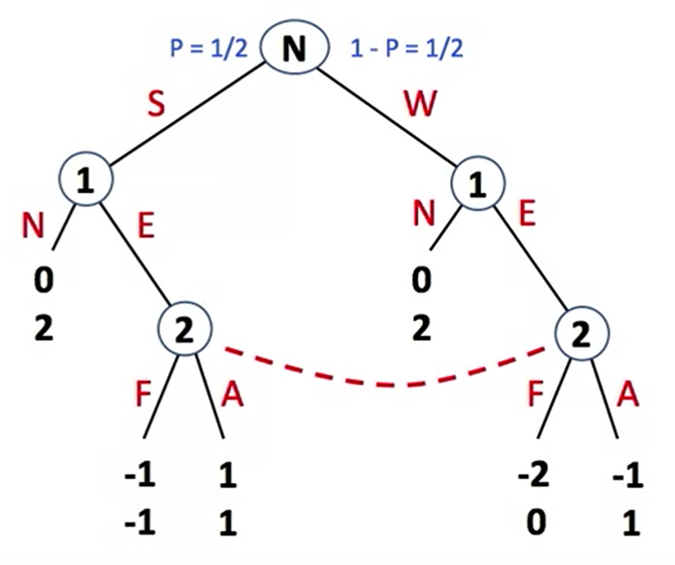

04 - Extensive-Form Games
================

## 4-1 Formalizing Perfect Information Extensive Form Games

#### Introduction

- The normal form game representation does not incorporate any notion of
  sequence, or time, of the actions of the players

- The **extensive form** is an alternative representation that makes the
  temporal structure explicit

- Two variants:

  - **Perfect-information** extensive form game
  - **Imperfect-information** extensive form game

> [!NOTE]
> Definition
> 
> A (finite) **perfect-information game** (in extensive form) is defined
> by the tuple $(N,A,H,A,Z,\chi,\rho,\sigma,u)$, where:
>
> - **Player**: $N$
> - **Action**: $A$
> - Choice nodes and labels for these nodes:
>
>  - **Choice nodes**: $H$ is a set of non-terminal choice nodes
>
>  - **Action function**: $\chi:H \rightarrow 2^A$ assigns to each choice
>    node a set of possible actions
>
>  - **Player function**: $\rho: H \rightarrow N$ assigns to each
>    non-terminal node $h$ a player $i \in N$ who chooses an action at
>    $h$
>
> - **Terminal nodes**: $Z$ is a set of terminal nodes, disjoint from $H$
>
> - **Successor function**: $\sigma: H \times A \rightarrow H \cup Z$ maps
>  a choice node and an action to a new choice node or terminal node such
>  that for all $h_1,h_2 \in H$ and $a_1,a_2 \in A$, if
>  $\sigma(h_1,a_1)=\sigma(h_2,a_2)$ then $h_1=h_2$ and $a_1=a_2$
>
>  - Choice nodes form a tree: nodes encode history
>
> - **Utility function**: $u=(u_1,...,u_n); u_i: Z \rightarrow R$ is a
>  utility function for player $i$ on the terminal nodes $Z$

## 4-2 Perfect Information Extensive Form: Strategies, BR, NE

From the Fig 1. Example: the sharing game, How many pure strategies does
each player has?

- Player 1: $3$

- Player 2: $2^3=8$

#### Pure Strategies

- A pure strategy for a player in a perfect information game is a
  **complete specification** of which action to take at each node
  belonging to that player

> [!NOTE]
> Definition (pure strategies)  
>
> Let $G=(N,A,H,Z,\chi,\rho,\sigma,u)$ be a perfect-information
> extensive-form game. Then the **pure strategies** of player $i$ consist
> of the cross product
>
> $$\prod_{h \in H, \rho(h) =i}\chi(h)$$

What are the pure strategies for player 2?

- $S_2 = \{(C,E);(C,F);(D,E);(D,F)\}$, total 4

What are the pure strategies for player 1?

- $S_1=\{(B,G);(B,H);(A,G);(A,H)\}$

- This is true even though, conditional on taking $A$, the choice
  between $G$ and $H$ will never have to be made

#### Nash Equilibria

Given our new definition of pure strategy, we are able to reuse our old
definitions of:

- mixed strategies

- best response

- Nash equilibrium

#### Induced Normal Form

- In fact, the connection to the normal form is even tighter

  - we can **convert** an extensive-form game into normal form

$$
\begin{array}{cccc} &\begin{array}{cccc} CE & CF & DE & DF \end{array}\\
\begin{array}{cccc} AG \\ AH \\ BG \\ BH \\
\end{array}&\left[\begin{array}{cccc}3,8 & 3,8 & 8,3 & 8,3 \\
3,8 & 3,8 & 8,3 & 8,3 \\
5,5 & 2,10 & 5,5 & 2,10 \\
5,5 & 1,0 & 5,5 & 1,0 
\end{array}\right]\end{array}
$$

- This illustrates the **lack of compactness** of the normal form

  - games aren’t always this small

  - even here we write down 16 payoff pairs instead of 5

- We can’t always perform the reverse transformation

  - e.g., matching pennies cannot be written as a perfect-information
    extensive form game

> [!NOTE]
> Theorem  
>
> **Every perfect information game** is extensive form has a PSNE

- This is easy to see since the players move sequentially

- What are the (three) pure-strategy equilibrium?

  - $(A,G),(C,F) = (3,8)$

  - $(A,H),(C,F) = (3,8)$

  - $(B,H),(C,E) = (5,5)$

## 4-3 Subgame Perfection

<figure>

<figcaption aria-hidden="true">Fig 2. Pure strategies
example</figcaption>
</figure>

- There’s something **intuitively wrong** with the equilibrium
  $(B,H),(C,E)$

  - why would player 1 ever choose to play $H$ if he got to the second
    choice node?

    - After all, $G$ dominates $H$ for him

  - He does it to **threaten** player 2, to prevent him from choosing
    $F$, and so gets $5$

    - However, this seems like a non-credible threat

    - If player 1 reached his second decision node, would he really
      follow through and play $H$?

#### Formal Definition

> [!NOTE]
> Definition (subgame of $G$ rooted at $h$)  
>
> The **subgame of** $G$ **rooted at** $h$ is the restriction of $G$ to
> the descendants of $H$

> [!NOTE]
> Definition (subgames of $G$)
> 
> This **set of subgames of** $G$ is defined by the subgames of $G$ rooted
> at each of the nodes in $G$

- $s$ is a subgame perfection equilibrium of $G$ iff for any subgame
  $G'$ of $G$, the restriction of $s$ to $G'$ is a Nash equilibrium of
  $G'$

- Notes:

  - since $G$ is its own subgame, every SPE is an NE

  - this definition rules out “non-credible threats”

#### Which equilibria are subgame perfect?

- Which equilibria from the example are subgame-perfect?

  - $(A,G),(C,F) = (3,8)$: is subgame perfect

  - $(A,H),(C,F) = (3,8): (B,H)$ is non-credible; not subgame perfect

  - $(B,H),(C,E) = (5,5): (A,H)$ is non-credible; though $H$ is “off-path”

## 4-4 Backward Induction

#### Computing Subgame Perfect Equilibria

Idea: Identify the equilibria in the bottom-most trees, and adopt these
as one moves up the tree

> function BACKWARDINDUCTION (node $h$) return $u(H)$
> 
> if $h \in Z$ then
>
> return $u(h)$
>
> *best.util* $\leftarrow -\infty$
>
> forrall $a \in \chi(h)$ do
>
> *util.at.child* $\leftarrow$ BACKWARDINDUCTION $(\sigma(h,a)$
>
> if *util.at.child* $_{\rho(h)}$ \> *best.util*$_{\rho(h)}$ then
>
> *best.util* $\leftarrow$ *util.at.chilf*
>
> return *best.util*

- *util_at_child* is a vector denoting the utility for each player

- the procedure doesn’t return an equilibrium strategy, but rather
  labels each node with a vector of real numbers

  - This labeling can be seen as an extension of the game’s utility
    function to the non-terminal nodes

  - Equilibrium strategies take the best action at each node

## 4-5 Subgame Perfect Application: Ultimatum Bargaining

#### Ultimatum Bargaining <https://en.wikipedia.org/wiki/Ultimatum_game>

- Player 1 makes an offer $x \in \{0,1,…,10\}$ to player 2

- Player 2 can accept or reject

- 1 gets $10-x$ and 2 gets $x$ if accepted

- Both get 0 if rejected

#### Ultimatum Bargaining: Subgame Perfect Equilibria

- Player 2 accepts every positive $x$

- If offered 0, Player 2 is indifferent and could accept or reject (or even
  mixed)

- Player 1 offers either 0 or 1 depending on 2’s decision at 0

#### Experiments: Dose Size of Pie Matter?

- Robert Slonim and Alvin Roth (1998) “Learning in High Stakes Ultimatum
  Games: An Experiment in the Slovak Republic,” *Econometrica*, Vol 66,
  pp 569-596.

- Varied from 60 Slovak Crowns, to 300, to 1500

- Average monthly wage then was 5500.

- So high stakes version in s week’s wage

- No significant differences across games in Offers:

  - 1000 units = 60SC: 451 avg, 465 median

  - 1000 units = 300SC: 460 avg, 480 median

  - 1000 units = 1500SC: 423 avg, 450 median

- Significant differences across games in Rejections of Offers of less
  than 250 Units:

  - 60SC: 1/1 rejected

  - 300SC: 10/21 rejected

  - 100SC: 12/32 rejected

#### Ultimatum Bargaining

- Subgame Perfection does not Always Match Data (Nash?)

- Rejections violate “rationality”?

- Or do we have the payoffs incorrect: people value equity, or feel
  emotions… Behavioral Game Theory

#### Summary: Subgame Perfection

- Subgame perfection and backward induction encapsulate *sequential
  rationality*

- Result in a subset of Nash equilibria

- Impose credibility in circumstances never reached:
  *off*-*the*-*equilibrium*-*path*

- But some games are hard to solve: Chess!

  - and not completely clear that people abide by the logic: need to
    believe in the rationality of others

- Next up: incomplete information

## 4-6 Imperfect Information Extensive Form: Poker

#### Extensive Form Games: Hidden Information

- Poker

  - Sequential play in betting/calling/folding

  - See some cards but not all

  - See bets and react to them

  - Have beliefs about the rationality and motivations of other players

  - Many possible hands

  - Many betting strategies

  - Impossible to draw the tree… However, there is much we can learn
    about such games

## 4-7 Imperfect Information Extensive Form: Definition, Strategies

#### Introduction

- So far, we’ve allowed players to choose an action at every choice node

  - This implies that players know the node they are in and all the
    prior choices, including those of other agents

  - We may want to model agents needing to act with partial or no
    knowledge of the actions taken by others, or even themselves

- **Imperfect information** extensive-form games:

  - each player’s choice nodes partitioned into **information sets**

  - agents cannot distinguish between choice nodes in the same
    information set

#### Formal Definition

> [!NOTE]
> Definition
>   
> An **imperfect**-**information game** (in extensive form) is a tuple
> $(N,A,H,Z,\chi,\sigma,u,I)$, where
>
> - $(N,A,H,Z,\chi,\rho,\sigma,u)$ is a perfect-information extensive-form
>  game, and
>
> - $I=(I_1,…I_n)$, where $I_i=(I_{i,1},…,I_{i,ki})$ is an equivalence
>  relation on (that is, a partition of) $\{h \in H: \rho(h)=i\}$ with
>  the property that $\chi(h)=\chi(h')$ and $\rho(h)=\rho(h')$ whenever
>  there exists a $j$ for which $h \in I_{i,j}$ and $h' \in I_{i,j}$

#### Strategies

<figure>

</figure>

- What are the equivalence classes for each player?

- How should we define the pure strategies for each player?

  - choice of an action in each **equivalence class**

- Formally, the pure strategies of player $i$ consist of the cross
  production $\prod_{I_{i,j} \in I_i} \chi(I_{i,j})$

#### Induced Normal-form games

- We can represent any normal form game

- Same as before: enumerate pure strategies for all agents

- Mixed strategies are just mixtures of the pure strategies

- Nash equilibria are also preserved

- We’ve now defined two mappings: NF $\rightarrow$ IIEF and IIEF
  $\rightarrow$ NF

  - what happens if we apply each mapping in turn?

  - we might not end up with the same game, but we do get one with the
    same strategy spaces and equilibria

## 4-8 Mixed and Behavioral Strategies

#### Randomized Strategies

- There are two meaningfully different kinds of randomized strategies in
  important information extensive form games

  - mixed strategies

  - behavioral strategies

- **Mixed strategies**: randomize over pure strategies

- **Behavioral strategy**: independent coin toss every time an
  information set is encountered

#### Randomized strategies example

<figure>

</figure>

- Example of a behavioral strategy

  - A with probability $0.5$ and $G$ with probability $0.3$

- Example of a mixed strategy that is not a behavioral strategy:

  - $0.6(A,G), 0.4(B,H)$ (why not?)

- In this game every behavioral strategy **corresponds to** a mixed
  strategy

#### Games of imperfect recall

Imagine that player 1 sends two proxies to the game with the same
strategies. When one arrives, he doesn’t know if the other has arrived
before him, or if he’s the first one

<figure>

</figure>

- What is the space of pure strategies in this game?

  - $1: (L,R); 2:(U,D)$

- What is the mixed strategy equilibrium?

  - Observe that $D$ is dominant for 2, $R, D$ is better for 1 then
    $L, D$, so $R, D$ is an equilibrium

- What is an equilibrium in behavioral strategies?

  - again, $D$ strongly dominant for 2

  - if I use the behavioral strategy $(p,1-p)$, his expected utility is
    $p^2+100(1-p)+2(1-p)$

  - simplifies to $-99p^2+98p+2$

  - maximum at $p=98/198$

  - thus equilibrium is $(98/198, 100/198), (0,1)$

- Thus, we can have equilibria in behavioral strategies that are
  different from equilibria in mixed strategies

## 4-9 Incomplete Information in the Extensive Form: Beyond Subgame Perfection

#### Solving Incomplete Information Extensive Form Games

<figure>

</figure>

- With incomplete information, there may not be many proper subgames

- But we can extend the reasoning

- Equilibrium concepts that explicitly model player’s beliefs about
  where they are in the tree for every information set (what the other
  players have done)

- Sequential Equilibrium and Perfect Bayesian Equilibrium - key
  features:

  - Beliefs are not contradicted by the actual play of the game (on the
    equilibrium path)

  - Players best respond to their beliefs

- With incomplete information, there may not be many proper subgames

- The ideas of sequential rationality extend once beliefs are modeled

#### Resources

Game Theory: <https://www.coursera.org/learn/game-theory-1>
