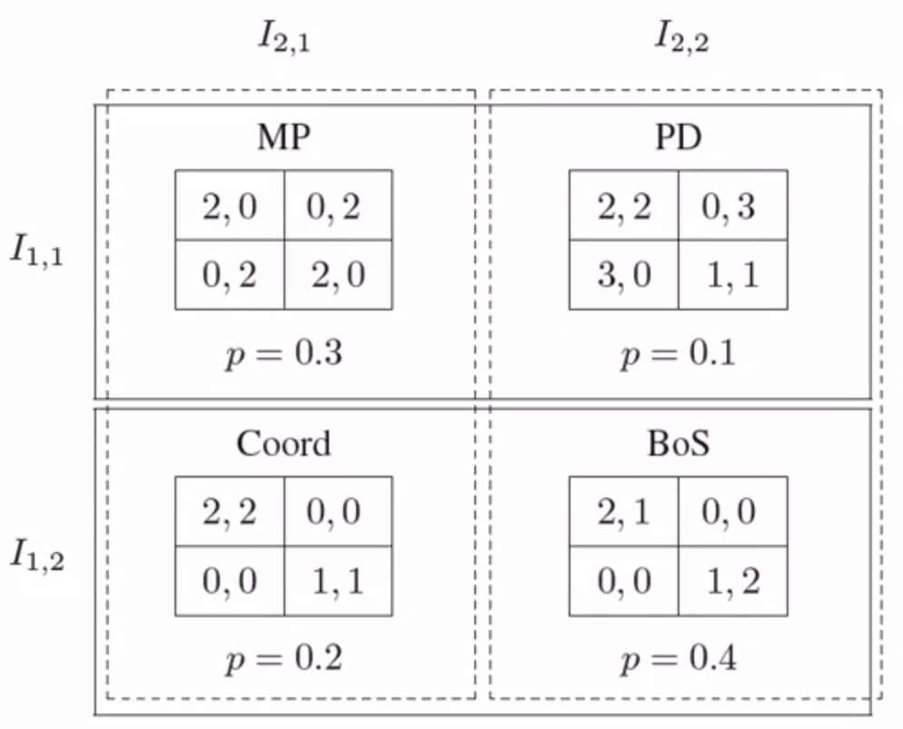

06 - Bayesian Games
================

## 6-1 Bayesian Games: First Definition

#### Introduction

- So far, we’ve assumed that all players know what game is being played.
  Everyone knows:

  - the number of players

  - the actions available to each player

  - the payoff associated with each action vector

- Why is this true in imperfect information games?

Now we’ll relax this. We’ll still assume:

1.  All possible games have the same number of agents and the same
    strategy space for each agent: differing only in payoffs
2.  Agents’ beliefs are posteriors, obtained by conditioning a common
    prior on individual private signals

#### Definition 1: Information Sets

- **Bayesian game**: a set of games that differ only in their payoffs, a
  common prior defined over them, and a partition structure over the
  games for each agent

> [!NOTE]
> Definition (Bayesian Game: Information Sets)  
>
> A **Bayesian game** is a tuple $(N,G,P,I)$ where
>
> - $N$ is a set of agents
>
> - $G$ is a set of games with $N$ agents each such that if
>  $g\cdot g' \in G$ then for each agent $i \in N$ the strategy space in
>  $g$ is identical to the strategy space in $g'$
>
> - $P \in \prod(G)$ is a common prior over games, where $\prod(G)$ is the
>  set of all probability distributions over $G$, and
>
> - $I=(I_1,...,I_N)$ is a set of partitions of $G$, one for each agent

## 6-2 Bayesian Games: Second Definition

#### Definition 2: Epistemic Types

- Directly represent uncertainty over utility function using the notion
  of **epistemic type**

> [!NOTE]
> Definition  
>
> **A Bayesian game** is a tuple $(N,A,\Theta,p,u)$ where
>
> - $N$ is a set of agents
>
> - $A=(A_1, …, A_n)$, where $A_i$ is the set of actions available to
>  player $i$.
>
> - \$\Theta = (\\Theta_1,…,\Theta_n)\$, where $\Theta_i$ is the type
>  space of player $i$
>
> - $p: \Theta \mapsto [0,1]$ is the common prior over types
>
> - $u=(u_1,…,u_m)$, where $u_i: A \times \Theta \rightarrow R$ is the
>  utility function for player $i$

#### Definition 2: Example

| $a_1$ | $a_2$ | $\theta_1$     | $\theta_2$     | $u_1$ | $u_2$ |
|-------|-------|----------------|----------------|-------|-------|
| U     | L     | $\theta_{1,1}$ | $\theta_{2,1}$ | 2     | 0     |
| U     | L     | $\theta_{1,1}$ | $\theta_{2,2}$ | 2     | 2     |
| U     | L     | $\theta_{1,2}$ | $\theta_{2,1}$ | 2     | 2     |
| U     | L     | $\theta_{1,2}$ | $\theta_{2,2}$ | 2     | 1     |
| U     | R     | $\theta_{1,1}$ | $\theta_{2,1}$ | 0     | 2     |
| U     | R     | $\theta_{1,1}$ | $\theta_{2,2}$ | 0     | 3     |
| U     | R     | $\theta_{1,2}$ | $\theta_{2,1}$ | 0     | 0     |
| U     | R     | $\theta_{1,2}$ | $\theta_{2,2}$ | 0     | 0     |
| D     | L     | $\theta_{1,1}$ | $\theta_{2,1}$ | 0     | 2     |
| D     | L     | $\theta_{1,1}$ | $\theta_{2,2}$ | 3     | 0     |
| D     | L     | $\theta_{1,2}$ | $\theta_{2,1}$ | 0     | 0     |
| D     | L     | $\theta_{1,2}$ | $\theta_{2,2}$ | 0     | 0     |
| D     | R     | $\theta_{1,1}$ | $\theta_{2,1}$ | 2     | 0     |
| D     | R     | $\theta_{1,1}$ | $\theta_{2,2}$ | 1     | 1     |
| D     | R     | $\theta_{1,2}$ | $\theta_{2,1}$ | 1     | 1     |
| D     | R     | $\theta_{1,2}$ | $\theta_{2,2}$ | 1     | 2     |

## 6-3 Analyzing Bayesian Games

#### Bayesian (Nash) Equilibrium

- A plan of action for each player as a function of types that maximize
  each type’s expected utility:

  - expecting over the actions of other players,

  - expecting over the types of other players,

#### Strategies

Given a Bayesian game $(N,A,\Theta,p,u)$ with finite sets of players,
actions, and types, strategies are defined as follows:

- **Pure strategy**: $s_i: \Theta_i \mapsto A_i$

  - a choice of a pure action for player $i$ as a function of his or her
    type

- **Mixed strategy**: $s_i: \Theta_i \mapsto \prod(A_i)$

  - a choice of a mixed action for player $i$ as a function of his or
    her type

- $s_i(a_i|\theta_i)$

  - the probability under mixed strategy $s_i$ that agent $i$ plays
    action $a_i$, given that $i$’s type is $\theta_i$

#### Expected Utility

Three standard notions of expected utility:

- **ex-ante**

  - the agent knows nothing about *anyone*’s actual type;

- **interim**

  - an agent knows her own type but not the types of the other agents;

- **ex-post**

  - the agent knows all agents’ types

#### Interim expected utility

- Given a Bayesian game $(N,A,\Theta,p,u)$ with finite sets of players,
  actions, and types, $i$’s **interim expected utility** with respect to
  type $\theta_i$ and a mixed strategy profile $s$ is

$$
EU_i(s|\theta_i)=\sum_{\theta_{-i} \in \Theta_{-1}}p(\theta_{-1}|\theta_i) \sum_{a \in A}(\prod_{j \in N}s_j(a_j|\theta_j))u_i(a,\theta_i,\theta_{-1})
$$

- $i$’s **ex ante** expected utility with respect to a mixed strategy
  profile $s$ is

$$
EU_i(s) = \sum_{\theta_i \in \Theta_i}p(\theta_i)EU_i(s|\theta_i)
$$

#### Bayesian Equilibrium or Bayes-Nash equilibrium

A **Bayesian equilibrium** is a mixed strategy profile $s$ that
satisfies

$$s_i \in arg /max_{s'_i}EU_i(s'_i,s _{-1}|\theta_i)$$

for each $i$ and $\theta \in \Theta_i$

The above is defined based on interim maximization. It is equivalent to
an ex ante formulation:

If $p(\theta_i)>0$ for all $\theta_i \in \Theta_i$, then this is
equivalent to requiring that

$$s_i \in arg /max_{s'_i}EU _ i(s'_i,s _{-1}|\theta_i) = s _i \in arg max _{s'_i}\sum p(\theta_i)EU_i(s' _i,s _{-1}|\theta_i)$$

for each $i$

- Explicitly models behavior in an uncertain environment

- Players choose strategies to maximize their payoffs in response to
  others accounting for:

  - strategic uncertainty about how others will play and

  - payoff uncertainty about the value to their actions

## 6-4 Analyzing Bayesian Games: Another Example

#### A Sheriff’s Dilemma

A sheriff is faces an armed suspect and they each must (simultaneously)
decide whether to shoot the other or not, and:

- the suspect is either a criminal with probability $p$ or not with
  probability $1-p$

- the sheriff would rather shoot if the suspect shoots, but not if the
  suspect does not

- the criminal would rather shoot even if the sheriff does not, as the
  criminal would be caught if does not shoot

- When criminal is good for $1-p$

$$
\begin{array}{ccc} &
\begin{array}{ccc} Shoot & Not \end{array}
\\
\begin{array}{cccc}
Shoot \\
Not \\
\end{array}
&
\left[
\begin{array}{cccc}
-3,-1 & -1,-2  \\
-2,-1 & 0,0  \end{array}
\right]\end{array}
$$

- When criminal is bad for $p$

$$ \begin{array}{ccc} & 
\begin{array}{ccc} Shoot & Not \end{array} 
\\
\begin{array}{cccc} 
Shoot \\ 
Not \\ 
\end{array} 
&
\left[ 
\begin{array}{cccc} 
0,0 & 2,-2  \\ 
-2,-1 & -1,1  \end{array} 
\right]\end{array} $$

## Resources

Game Theory: <https://www.coursera.org/learn/game-theory-1>
